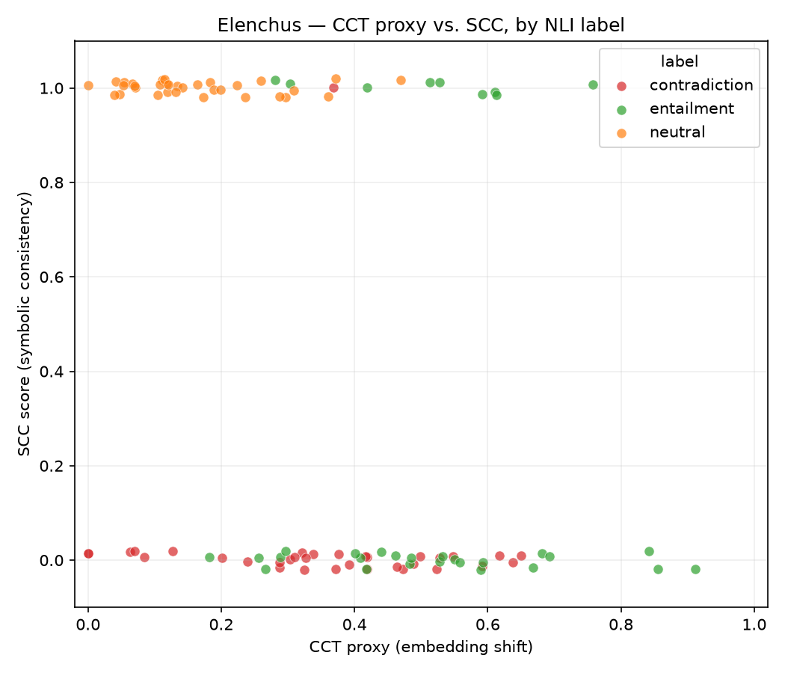

# Elenchus — SCC Experiment Results

**Date:** 2026-07-09 ·
**Sample:** 100 stratified e-SNLI test examples (33 E / 33 N / 34 C, seed 42) ·
**Knowledge source:** WordNet (offline; see §2) ·
**Environment:** Windows 11, Python 3.14.0, clingo 5.8.0, torch 2.13.0+cpu,
sentence-transformers 5.6 (`all-MiniLM-L6-v2`)

## TL;DR

**The core hypothesis holds numerically, but not for the stated reason.**
CCT and SCC diverge most strongly on Neutral examples — mean |CCT − SCC|
divergence is **0.837** for Neutral vs. 0.508 (Entailment) and 0.363
(Contradiction), one-sided permutation test **p ≈ 0.0001**. However, the
README's rationale ("high CCT scores on Neutral reflect statistical
artifacts") is *not* what drives this: Neutral examples actually have the
**lowest** CCT proxy scores (mean 0.163). The divergence is instead produced
by the symbolic layer, which declares *every* Neutral example consistent
(SCC = 1.0 for 33/33) because Neutral support is defined as the *residual*
("no entailment and no contradiction evidence found") and symbolic evidence
is sparse. The hypothesis test should therefore be read as *confirmed in
direction, but partially by construction* — see §4.

## 1. Implementation review — issues found and fixed

The pipeline was reviewed before running. Five substantive issues were found
and fixed; all fixes are in `pipeline.py` / `rules.lp`.

| # | Issue | Severity | Fix |
|---|-------|----------|-----|
| 1 | `load_dataset("esnli")` is a script-based HF dataset — fails on `datasets >= 3` (script support removed). The HF copy also has **no highlight columns**, so the "human highlights" IA extractor silently never triggered and always fell back to bag-of-content-words. | Blocking | Loader now uses the authors' official CSV (`esnli_test.csv`, auto-downloaded from the e-SNLI GitHub repo), which contains the `Sentence1_marked_1` / `Sentence2_marked_1` human highlights. Mean IAs/example dropped from ~12 (bag of words) to **2.4** (true highlights). |
| 2 | ConceptNet edge orientation: when the queried term was the *end* node of an asymmetric edge, the relation was emitted reversed (querying "animal" on the edge *dog IsA animal* produced `is_a(animal, dog)`). No language filter either. | High | Asymmetric relations (`IsA`, `PartOf`, …) are kept only when the queried term is the start node; symmetric ones (`Antonym`, `DistinctFrom`) may match either side. Non-English endpoints are dropped. |
| 3 | ASP rule `supports_contradiction :- antonym(T1, T2).` fired when *any* IA had *any* antonym in the knowledge base — nearly every adjective does — regardless of whether that antonym occurs in the example. | High | `pipeline.py` now emits `ia/1` facts; the rule requires **both** members of the antonym pair to be IAs of the example. Terms are lemmatised (WordNet morphy) before grounding so "sleeping"/"asleep"-style inflection still unifies. |
| 4 | `scc_weighted` **inverted** the verdict at low evidence: a consistent verdict with 0 relations scored 0.0 and an inconsistent one scored 1.0. | Medium | Weighted score now shrinks the binary verdict toward the uninformative midpoint 0.5: `0.5 + (base − 0.5) · confidence`. |
| 5 | Transient ConceptNet errors (5xx, timeouts) were cached as permanently-empty terms — one API outage would poison the on-disk cache. | Medium | Only successes and 404s are cached; transient failures are retried on the next run. |

## 2. Experimental setup

- **Data:** official e-SNLI test split (Camburu et al. 2018), label-stratified
  sample of 100 (seed 42). IAs come from annotator-1 human highlights, with
  the documented fallbacks; mean 2.4 IAs/example, 2 examples end up with 0 IAs
  after stopword filtering.
- **Knowledge source:** the public ConceptNet API (`api.conceptnet.io`)
  returned **502 for every request** at run time (it has been unstable since
  Luminoso wound down support), so an offline **WordNet backend** was added
  behind the same `lookup()` interface (`--kb wordnet`): hypernym→`IsA`,
  part/member holonym→`PartOf`, attribute→`HasProperty`, verb-cause→`Causes`,
  lemma antonym→`Antonym`. Mean 20 relations/example; 3 examples had none.
  This also makes the run fully deterministic and reproducible.
- **CCT proxy:** `1 − cos(emb(explanation), emb(explanation \ IAs))` with
  `all-MiniLM-L6-v2`, as in the repo. Note this is an *embedding-shift proxy*,
  not Atanasova et al.'s actual CCT (which measures the explained model's
  prediction shift under counterfactual insertions).
- **Command:** `python pipeline.py --n 100 --kb wordnet --out-dir results`

## 3. Results

### Divergence by label (primary hypothesis test)

| Label | mean \|CCT − SCC\| | std | n |
|---|---|---|---|
| **neutral** | **0.837** | 0.111 | 33 |
| entailment | 0.508 | 0.182 | 33 |
| contradiction | 0.363 | 0.186 | 34 |

One-sided permutation test (Neutral vs. rest, 10 000 shuffles):
Δmean = **+0.403**, **p = 0.0001**. Excluding the two 0-IA examples changes
nothing (Neutral mean 0.832). The two metrics are moderately
*anti*-correlated overall (Pearson r = **−0.42**).

### Component means — what actually produces the divergence

| Label | CCT proxy | SCC (binary) | SCC (weighted) |
|---|---|---|---|
| neutral | **0.163** | **1.000** | 0.964 |
| entailment | 0.515 | 0.273 | 0.273 |
| contradiction | 0.355 | 0.029 | 0.059 |

### Symbolic support vs. gold label (confusion of the ASP layer)

| Gold label | E support | C support | both | neutral (residual) |
|---|---|---|---|---|
| entailment | 9 | 1 | 0 | 23 |
| contradiction | 10 | 0 | 1 | 23 |
| neutral | 0 | 0 | 0 | 33 |

Read as a 3-way label predictor, the symbolic layer reaches **42 %** accuracy
(always-neutral baseline: 33 %). Entailment evidence (shared WordNet
category/property) fires on entailment and contradiction examples at
essentially the same rate (9/33 vs. 11/34) — i.e., it detects *topical
relatedness*, not entailment. Contradiction evidence almost never fires
(1/34) after the in-example antonymy fix, because SNLI contradictions are
mostly situational ("swimming" vs. "sleeping") rather than lexical antonym
pairs.

### Scatter



The SCC = 1 band is dominated by Neutral points clustered at *low* CCT proxy;
Entailment splits between the two bands; Contradiction sits almost entirely
at SCC = 0. Full per-example data: `results/results.csv`; top-10 divergence
cases: `results/divergence_report.txt`.

## 4. Does the hypothesis work out?

**Directionally: yes.** Neutral shows by far the highest CCT/SCC divergence,
and the effect is large (Δ ≈ +0.40 vs. the other labels) and statistically
significant (p ≈ 10⁻⁴). Under the paper-style reading — "SCC adds a semantic
check that CCT lacks, and the two disagree most on Neutral" — the experiment
supports the claim.

**Mechanistically: only partially.** The stated rationale predicts *high* CCT
on Neutral being unmasked as artifact by low SCC. The data show the opposite
configuration:

1. **Neutral CCT is the *lowest*** (0.163 vs. 0.515/0.355). e-SNLI Neutral
   explanations are template-like ("Not all X are Y", "Just because … does
   not mean …") and lean little on the highlighted terms, so masking IAs
   barely moves the embedding.
2. **Neutral SCC = 1.0 by construction.** `supports_neutral` is the residual
   of the other two rules; with only ~2.4 IAs and sparse symbolic evidence,
   "no evidence found" is the common case — which counts as *consistent* for
   Neutral and *inconsistent* for E/C. About 23/33 "consistent Neutral"
   verdicts are evidence-free rather than positively verified (the weighted
   SCC variant now exposes this: an evidence-free verdict scores 0.5).

So the divergence is real but is largely a statement about *where each metric
degenerates* (CCT proxy → 0 on template explanations; SCC → 1 on Neutral via
the residual rule), not yet about genuine semantic verification catching
statistical artifacts.

## 5. Limitations

- The CCT proxy is not CCT: no explained model is in the loop, so no causal
  counterfactual test is performed.
- WordNet (like ConceptNet) encodes lexical, not situational, knowledge —
  contradiction recall is structurally poor on SNLI (1/34).
- The SNLI-specific stopword list removes `man/woman/person/people`, which
  discards exactly the antonym pair behind many SNLI contradictions (kept
  as-is from the original design, since including them floods entailment
  support via `man IsA person`).
- n = 100, single seed, single annotator's highlights; ConceptNet could not
  be compared against WordNet because its API was down.

## 6. Reproducing

```bash
python -m venv .venv && .venv/Scripts/activate   # short path on Windows!
pip install -r requirements.txt
python pipeline.py --n 100 --kb wordnet --out-dir results
```

Notes: on Windows, create the venv at a **short path** — torch's header
paths exceed MAX_PATH under a deeply nested folder. `esnli_test.csv`
(~7 MB) and the WordNet corpus (~10 MB) download automatically on first run.
The run is deterministic (seeded sampling + local KB): the numbers above
reproduce exactly.

## 7. Suggested next steps

1. **Replace the residual Neutral rule** with positive neutral evidence
   (e.g., hypothesis-IA has *no* WordNet path to any premise-IA), so Neutral
   consistency is verified rather than assumed; then re-test the hypothesis.
2. Use a real NLI model and implement actual CCT (prediction shift under
   counterfactual edits) instead of the embedding proxy.
3. Make entailment evidence directional (premise-term → hypothesis-term
   hypernymy) instead of "any shared category", which currently fires equally
   on contradictions.
4. Scale to n = 500+ and multiple seeds; report bootstrap CIs.
5. Re-run with ConceptNet when api.conceptnet.io recovers (`--kb conceptnet`)
   to measure KB sensitivity.
